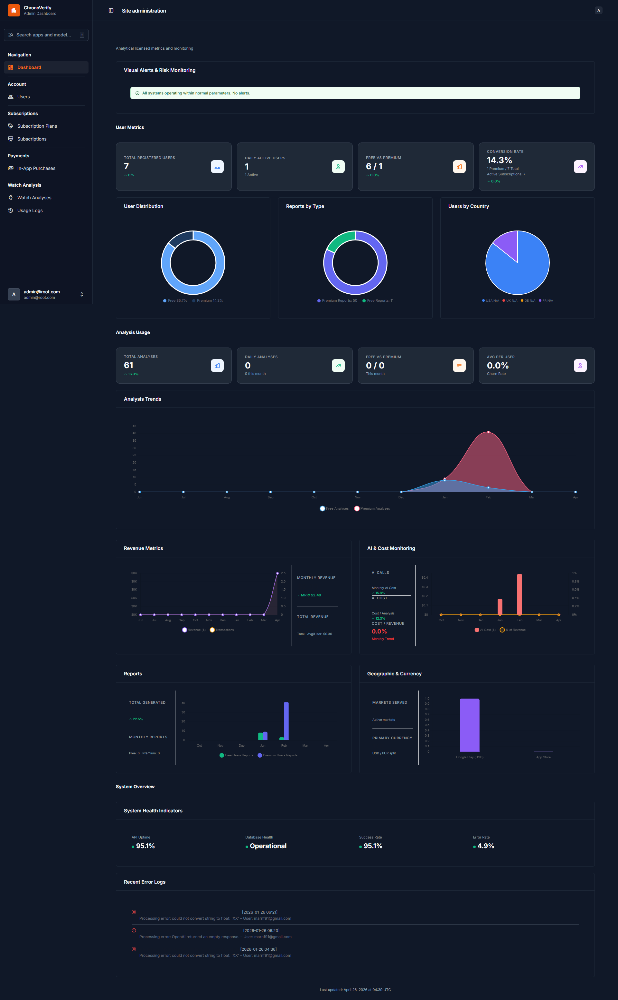

# 🚀 WatchVerify


**WatchVerify** is a Django-based analytics and monitoring platform that provides real-time insights into user activity, subscriptions, revenue, and system performance — enhanced with **RevenueCat for subscription management** and **Firebase for real-time services & notifications**.

---

## 📊 Dashboard Preview



---

## ✨ Key Features

### 📈 User Analytics

* Total users & active users
* Free vs premium tracking
* Conversion rate monitoring

### 💳 Subscription Management (RevenueCat)

* Cross-platform subscription handling
* Webhook-based backend sync
* Plans: Monthly / Yearly / Unlimited
* Real-time subscription status updates

### 🔥 Firebase Integration

* Push notifications (FCM)
* Real-time updates
* Event tracking & analytics
* Optional authentication support

### 📊 Reports & Insights

* Reports by type
* Monthly trends
* Usage analytics

### 💰 Revenue Tracking

* Monthly revenue
* Subscription-based earnings
* Conversion metrics

### 🤖 AI & Cost Monitoring

* API usage tracking
* Cost vs revenue comparison

### ⚙️ System Health

* API uptime
* Database health
* Error monitoring

---

## 🏗️ Tech Stack

| Layer        | Technology                    |
| ------------ | ----------------------------- |
| Backend      | Django, Django REST Framework |
| Database     | PostgreSQL / SQLite           |
| Auth         | Firebase                      |
| Subscription | RevenueCat                    |
| Frontend     | Flutter                       |
| Charts       | Chart.js / Recharts           |

---

## ⚡ Getting Started

### 1️⃣ Clone Repo

```bash id="cln1"
git clone https://github.com/your-username/watchverify.git
cd watchverify
```

---

### 2️⃣ Setup Environment

```bash id="env2"
python -m venv venv
venv\Scripts\activate  # Windows
# source venv/bin/activate  # Mac/Linux
```

---

### 3️⃣ Install Dependencies

```bash id="dep3"
pip install -r requirements.txt
```

---

### 4️⃣ Environment Variables

Create `.env` file:

```env id="envfile4"
DEBUG=True
SECRET_KEY=your_secret_key

DATABASE_URL=sqlite:///db.sqlite3

# Firebase
FIREBASE_CREDENTIALS=path/to/firebase.json
FIREBASE_API_KEY=your_api_key

# RevenueCat
REVENUECAT_API_KEY=your_revenuecat_api_key
REVENUECAT_WEBHOOK_SECRET=your_webhook_secret

ALLOWED_HOSTS=*
```

---

### 5️⃣ Run Project

```bash id="run5"
python manage.py migrate
python manage.py createsuperuser
python manage.py runserver
```

---

## 🔗 RevenueCat Integration

### 📦 Subscription Packages Example

| Package ID        | Product Identifier        |
| ----------------- | ------------------------- |
| premium_analysis  | premium-analysis          |
| standard_analysis | standard-analysis         |
| unlimited_monthly | premium-unlimited-monthly |
| unlimited_yearly  | premium-unlimited-yearly  |

---

### 🔔 Webhook Setup

* Endpoint:

```
/api/webhooks/revenuecat/
```

* Handles:

  * Purchase events
  * Renewals
  * Cancellations
  * Expirations

### 🔁 Flow

1. User purchases subscription (mobile/web)
2. RevenueCat processes purchase
3. Webhook triggers Django backend
4. Backend updates user subscription

---

## 🔥 Firebase Integration (Authentication)

WatchVerify uses **Firebase Authentication** to handle secure user login and identity management.

### 🔐 Features Used:
- Email & Password Authentication
- Google Sign-In (optional)
- Secure token-based authentication
- Firebase ID token verification in Django backend

---

### ⚙️ Setup

1. Create a Firebase project
2. Enable **Authentication → Sign-in methods**
3. Download service account JSON
4. Add credentials in `.env`

```env
FIREBASE_CREDENTIALS=path/to/firebase.json
FIREBASE_API_KEY=your_api_key

---

## 📁 Project Structure

```bash id="struct6"
watchverify/
│── apps/
│   ├── users/
│   ├── subscriptions/
│   ├── analytics/
│   ├── reports/
│   ├── payments/
│
│── core/
│── services/
│   ├── firebase/
│   ├── revenuecat/
│
│── templates/
│── static/
│── manage.py
```

---

## 📡 API Endpoints

| Endpoint                    | Description        |
| --------------------------- | ------------------ |
| `/api/users/`               | Users              |
| `/api/subscriptions/`       | Subscription data  |
| `/api/analytics/`           | Dashboard metrics  |
| `/api/revenue/`             | Revenue stats      |
| `/api/webhooks/revenuecat/` | RevenueCat webhook |

---

## 🐳 Docker (Optional)

```bash id="docker7"
docker build -t watchverify .
docker run -p 8000:8000 watchverify
```

---

## 🚀 Deployment

* AWS EC2
* DigitalOcean
* Render
* Railway

Use:

```bash id="gunicorn8"
gunicorn config.wsgi:application
```

---

## 🧪 Testing

```bash id="test9"
python manage.py test
```

---

## 🤝 Contributing

```bash id="contri10"
git checkout -b feature-name
git commit -m "feature added"
git push origin feature-name
```

---

## 📄 License

MIT License

---

## 👨‍💻 Author

**Morshed Nayeem**

---

## ⭐ Support

Give a ⭐ if you like this project!
